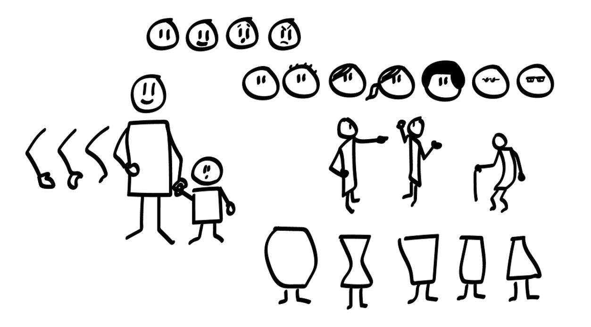

My goal is to make anybody able to draw to communicate. In order to teach yourself and your colleagues how to draw to communicate, I have put together the definitive do-it-yourself workshop list. By reading and following the blog posts below you will be able to run a four-part ‘Draw to communicate’ workshop together with colleagues or customers.

# Workshop exercises

## 1. The visual alphabet [to be added]

Your building blocks to draw quickly

## 2. Draw fast enough and good enough [to be added]

How to simplify so you can draw fast enough and know when to add details to communicate crusial differences.

## 3. Human beings and interaction

Get your people to interact.

> **[Human beings and interaction — Get your people to interact](../human-beings-and-interaction/)**
>
> Key takeaway: How to draw people. How to make them interact. Emotions, middle aged, young, old, different looks and body shapes.
> 

## 4. Storytelling [to be added]

Use your drawing skills to communicate.

# About the workshop series

You can complete this part in a day, or spread it out and use half an hour to an hour here and there.

# Why you should draw?

Because words don’t communicate that well on it's own.

Words are so quick to write, but why don’t they work all that well? It’s partly hidden in this historical quote by the French mathematician and philosopher Blaise Pascal:

> [If I Had More Time, I Would Have Written a Shorter Letter](https://quoteinvestigator.com/2012/04/28/shorter-letter/). 

## Are you sure your message went through?

Why write short phrases? Because too many words make the message harder to understand. Even if writing is easy, communicating precisely with words is hard. The stuff you write for communication purposes quickly become massive and without focus.

Interpreting takes time and makes you vulnerable to what images those words actually create. Is it the same boat you’re talking about?

This leads us to the receiving end of the words. The audience needs to interpret all the words before an image is created. This takes time and is often not very accurate.

In a PowerPoint or Keynote setting, presenting wordy slides will make your audience feel an interference between reading and listening to you talking.

A lot of noise and little time to pay attention to the actual story.

That’s a lot of noise that comes in the way of good storytelling!

## Why drawing works well

There is not that much to say about drawing. A drawing just works, straight out of the box. There is a lot less interpretation between a drawing and the image it creates than between words and the images they create.

Of course, you can’t communicate everything with drawings, but it’s good to visualize the main concepts and starting points in your story. It ensures you and the people you’re talking to are on the same page and discussing the same issue.

The big problem is that drawing takes time. At least if you don’t practice it. That’s where some quick tips and tricks come in handy.

## You can do this yourself, I promise!

My goal is to make anybody who is interested able to read through these blog posts, run a 4 part workshop together with colleagues, and then be able to draw to communicate. I’ve had a lot of fun running workshops for a while. It has taught me a lot more about how to draw to communicate, what’s important and what is not, and how to better teach it to others. But I’m an Interaction Designer / UX person, and I don’t want to only be “Drawing workshop person”. I do, however, want a lot of people to learn how to draw to communicate. It can be a fantastic tool for you too. But running workshops don’t scale. That’s why I’m trying to make this a kit for self-teaching.

The four workshop setup should be enough for you to get going. Start out among people you trust if you’re a bit unsure whether it will work or not. Set up a time schedule for the full workshop you intend to facilitate and follow it. You should, either before the workshop or at the beginning of it, do a quick introduction as to why it’s a good thing to draw to communicate.

Many people have done this before me, so these are not original ideas, I just happen to be interested enough to make a little bit out of it. Now you can do the same =) Please do! If you need help or want to discuss some aspects of this, contact me on LinkedIn, Twitter or post a comment to this post, and I’ll try to help you out.

## Why draw to communicate?

To communicate ideas and thoughts precisely to others, read more about the motivation to draw in this earlier blog post: “How to draw to communicate”, now renamed “Why draw to communicate”.

Drawing will, I guess, always be harder than writing. But this might have two positive effects:

1. You need to remove unnecessary details when drawing — only communicating the essential parts of your story.
1. The process of drawing a story can make you figure out what’s the real essence of it. It makes it easier to see where your story and ideas have logical flaws, and it is also an easy way to “show, don’t tell”.