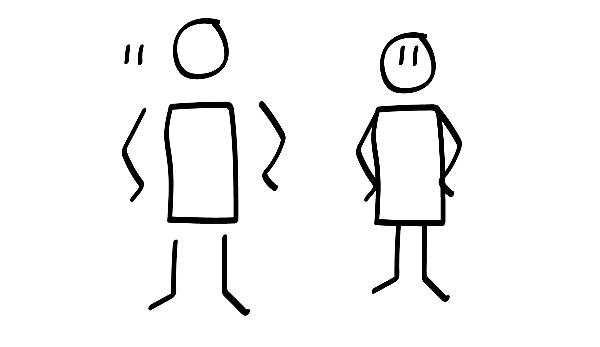
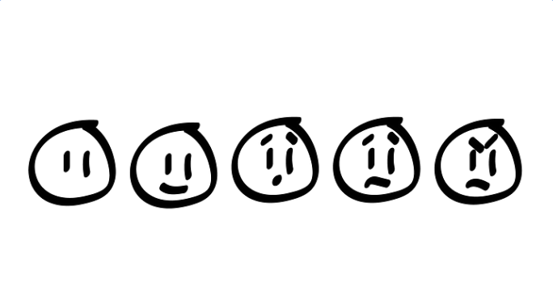
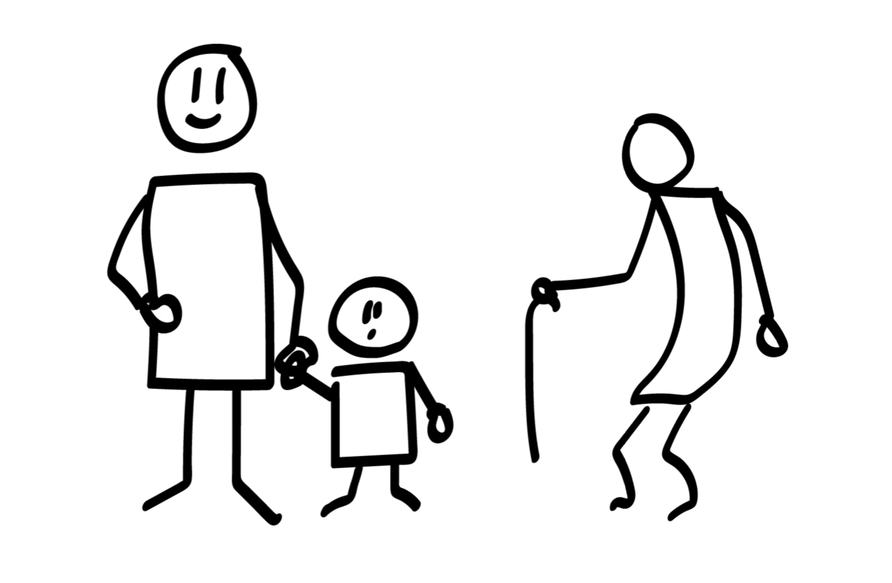
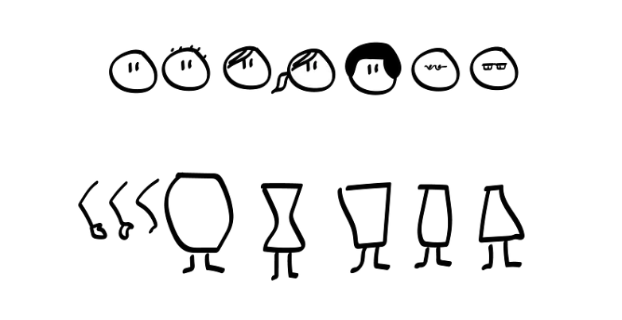
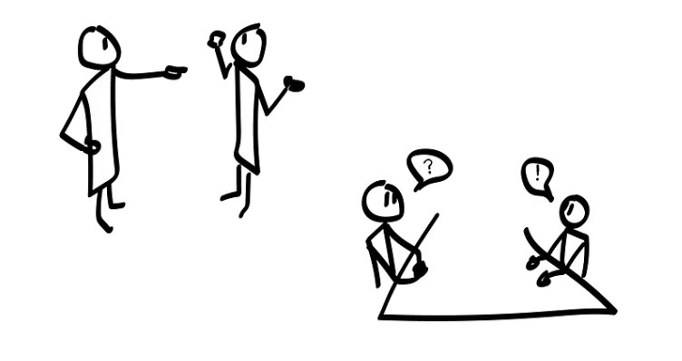
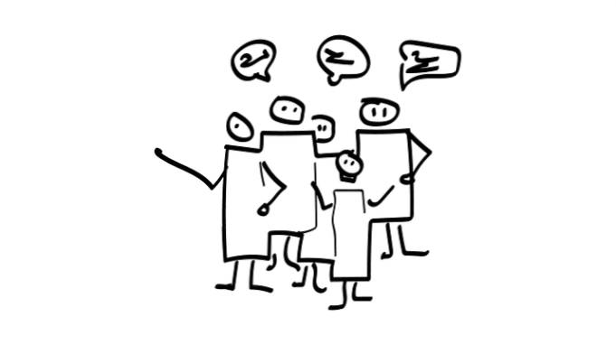

Stick figures can work for a lot of scenarios, but several of them interacting isn’t one of them. They tend to look very alike, not letting you differentiate them when you need to.

> Key takeaway: How to draw people. How to make them interact. Emotions, middle aged, young, old, different looks and body shapes.

_Workshop setup — part of [Drawing to communicate workshop series]()._

# 1. Draw a human being (2 minutes)

Tell your participants to draw as many humans they can. Rectangular body, feet, eyes and mouth will later help you understand which way your human is pointing.

# 2. Draw emotions (3 minutes)

Add as little details as possible. No emotions needed, skip the mouth and eye-brows.

Tell the participants to draw (30 seconds on each drawing)

* Without emotion
* Happy
* Surprised
* Sad
* Angry

# 3. Draw different ages (3 minutes)

Tell the participants to draw (1 minute on each drawing)

* A middle aged person
* A kid
  Kids have larger heads compared to body size, closer to square body and smaller arms and legs compared to body size.
* An old person
  Add age appropriate accessories and maybe bend the body shape a little?

  

# 4. Draw styles and body shapes (4 minutes)

* Draw as many hair and face styles you can (2 minutes)
* Draw as many body styles you can (2 minutes)

# 5. Interaction (3 minutes)

* Someone arguing or one person yelling at another
* Two people sitting by a desk, talking.

# 6. Draw a group of people (2 minutes)

Skip details to draw groups. Make the body rectangles merge, and remove some arms and legs.

* Draw a group that is either happy, angry or confused

# That’s it!

The third part of the workshop is done. You now know how to draw human beings and make them interact!

If you need help or want to discuss some aspects of this? [Contact me on LinkedIn](https://www.linkedin.com/in/espen-klem/), or [create an issue over at GitHub](https://github.com/eklem/draw-to-communicate-workshops/issues/new), and I’ll try to help you out.