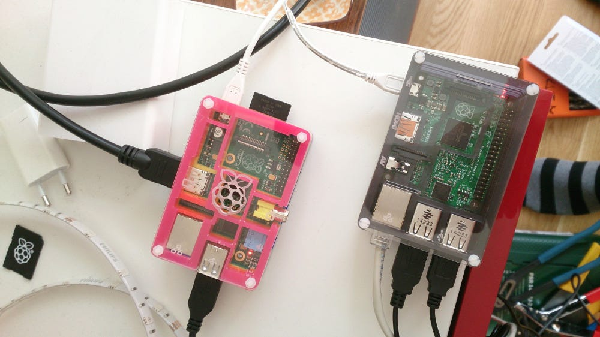

Things are actually going according to plan. Automatic indexing is up and running, and search is working, so now it’s time for a search information model. A search information model is kind of the information architecture of a search solution. The difference is that a good search engine revolves around the user more than a web page structure. You mold your information architecture to best fit your user, even if this doesn’t match the underlying architecture fully. The search information model will be the basis of the user experience, web design and front end code. A good reason a search solution has to revolve around the user, is that a user types in his/her words. If you ever see a search log, you’ll notice you’re looking at a users intention.

Above is the search information model so far. One example where the search information model doesn’t match the information architecthure is the user category. I don’t have any documents matching users, but I’ll agregate and consolidate so it will be one in the search solution. A user will then possibly consist of the following elements:

* Name
* Email address
* Phone number
* gravatar photo/icon
* User names/IDs for:
* Twitter
* Instagram
* Flickr
* GitHub

This will, in adition to a regular search, give me a per user search. I can search, find a user, click on that user and instead of going to a document that doesn’t exist, I can get a special search page for this person. I’ll be able to do something similar for “Events”, where I can show all results near (in time) a calendar or position event. All data is gathered by IFTTT IF-recipes and stored in spreadsheets in Google Drive. At the beginning of the project, I made a lot if IFTTT-recipes. Just by looking at the spreadsheets it was easy to figure out which sources were useful and which were not. A task manager called Remember the Milk seemd like a nice source to index, but looking at the data gathered, I understood it would only add noice. Nothing there triggered any re-finding nerve, which this search is all about: Indexing stuff, or actions/reactions, that I want to find back to and revisit at a later time. SMS’es also looked like a nice source for indexing, but when looking at the SMS’es stored, it was just to creepy to add to a search index. Also some sources are not that good because of limitations in IFTTT. One example is Facebook status message. It doesn’t have an item ID. That means I can’t link back to the actual message. But Facebook links and replies are okay.

## Document preview and search engines

Ok search solutions have document previews. You need a preview since a lot of the documents are not web formats. These previews are either images of a front page, or an HTML template faking the document layout. Either way, it’s not very interactive. It’s a display of what you might see if you take the time to click on the document and wait for it to open. Not so with Personal Search. The idea is to have a regular search result column in center, and actual content to the left. If I click/hover on an interesting tweet search result, I’ll get the full discussion thread to the left with all the interaction of Twitter to continue the discussion. All this with a message ID and an developer API.

## What’s now and what’s next?

_A Raspberry Pi running Norch_

Automated indexing is working, and so is searching. I get a lot of duplicates, so will switch from using Norch-indexer to Search-index’ si.add function to get a more fine graind control when indexing documents. Anyhow, that’s fairly straight forward.

Search is working. Not looking pretty, and missing a lot of functional stuff. But working facets and all, and that’s great! It’s running of a Raspberry Pi 2 with Raspbian (Debian Wheezy) and it’s lightning fast. The first Raspberry Pi B was fast enough to handle search queries and deliver search results, but it’s a little underpowered for the indexing task. That leaves me with what’s next. First off, I’m going to make some quick interaction designs and create a static HTML prototype. The prototype will be a fork of the Norch-bootstrap repository and become Personal Search to quickly start creating a better frontend. In between there will be more code added to the document processing tool: IFTT-Norch-tools.

_Unfiltered search showing available filters for search query_

_Search result filtered on facet_

[Last time, it was only an idea](../your-life-searchable/#issues-discovered-so-far). Now search and facets are working nicely. More to come =)